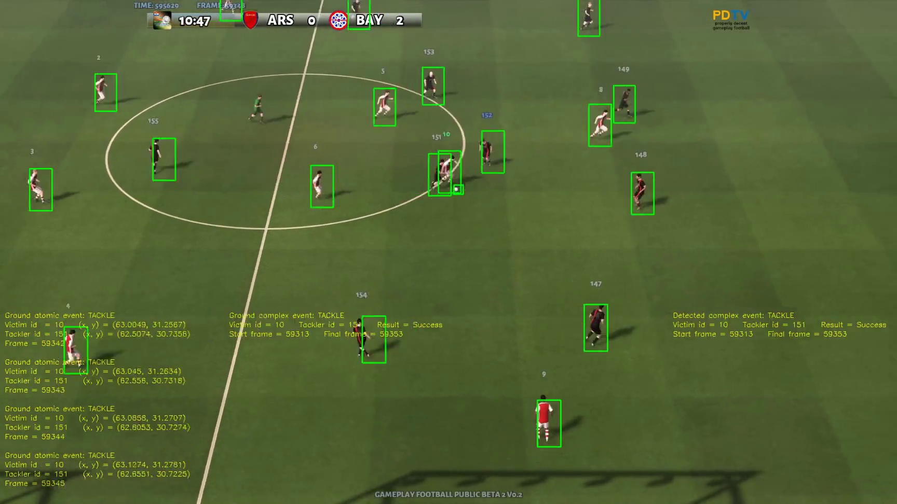

# Slicing and dicing soccer

This folder contains the open-source game Gameplay Football.
A complete soccer game including all the most common events such as goals, fouls, corners, penalty kicks.

#Screenshot
Example of generated by game play with bounding boxs and ID of each player.

#Attribution
Source Code: https://github.com/BazkieBumpercar/GameplayFootball.